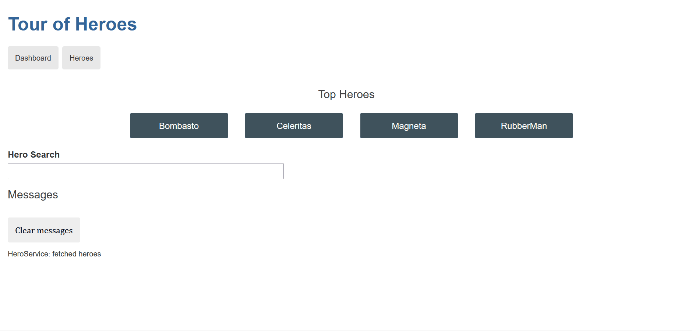

<h1 align="center">
    
</h1>

<p align="center">
  <a href="#execution">Preview</a>&nbsp;&nbsp;&nbsp;|&nbsp;&nbsp;&nbsp;
  <a href="#technologies">Technologies Used</a>&nbsp;&nbsp;&nbsp;|&nbsp;&nbsp;&nbsp;
  <a href="#run">How to run the project</a>&nbsp;&nbsp;&nbsp;|&nbsp;&nbsp;&nbsp;
  <a href="#contribute">How to contribute</a>&nbsp;&nbsp;&nbsp;|&nbsp;&nbsp;&nbsp;
  <a href="#license">License</a>
</p>

<p align="center">
 

  

  
</p>

<br>

## :books: About

The Tour of Heroes application helps a staffing agency manage its stable of heroes.

The finished application:

- Gets a list of heroes
- Displays the heroes in a list
- Edits a selected hero's details
- Navigates between different views of heroic data

<a id="execution"></a><br>

## :tv: Preview



<a id="technologies"></a><br>

## ⚒️ Technologies Used

- CSS3
- HTML5
- Angular
- TypeScript

<a id="run"></a><br>

## 🚀 How to run the project

<br>

- Clone this repository

```
git clone https://github.com/RuthMaria/tourOfHeroesAngular.git
```

- Install dependencies

```
yarn
```

or

```
npm i
```

- Run the project

```
 ng serve
```

- Navigate

```
http://localhost:4200/
```

## Code scaffolding

Run `ng g component component-name` to generate a new component. You can also use `ng generate directive|pipe|service|class|guard|interface|enum|module`.

## Create a new project

Run `ng new project-name` in power shell with admin permission

<br>

## 🎯 How to contribute

- Fork this repository,
- Create a branch with your feature: `git checkout -b my-feature`
- Commit your changes: `git commit -m 'feat: My new feature'`
- Push your branch: `git push origin my-feature`

<a id="license"></a><br>

## :memo: License

This project is under the MIT license. See the file [LICENSE](LICENSE) for more details.

---

<h4 align="center">
    Developed with ❤️ by <a href="https://www.linkedin.com/in/ruth-maria-9b256071/" target="_blank">Ruth Maria</a>
</h4>
